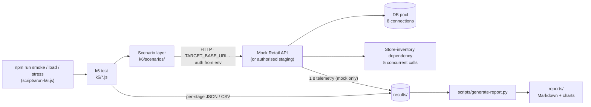
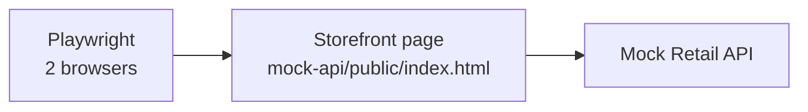

# Enterprise Load & Stress Testing Framework

Incremental capacity testing with k6: find where a system is healthy, where it degrades, what saturates first,
how it fails, and whether it recovers. Browser-level journeys are validated separately with Playwright.

**At a glance:** smoke → incremental load (10 → 500 VUs) → knee refinement (300 → 500) → stress (to 1000) →
recovery, against a safe local mock API · results in [reports/performance-report.md](reports/performance-report.md)
· run it with [Quick Start](#7-quick-start) · point it at staging with [Running Against Authorised Staging](#8-running-against-authorised-staging).

### Repository map

| Path | What it is |
|---|---|
| `README.md` | Project overview, methodology, example results, how to run |
| `k6/` | The load-testing framework: test entry points, scenarios, utilities, configuration |
| `mock-api/` | Safe, controlled target: mock omnichannel retail API with realistic constraints |
| `browser/` | Playwright end-to-end journey (small scale, not a load generator) |
| `scripts/` | Run helper (`run-k6.js`) and report generator (`generate-report.py`) |
| `reports/` | **Human-readable** generated analysis: Markdown reports + charts (committed) |
| `results/` | **Raw** machine-generated test artifacts: JSON, CSV, telemetry (git-ignored) |
| `docs/` | Interview notes: design rationale and talking points |

---

## 1. Executive Summary

An enterprise omnichannel retailer asks: *"Can your product handle our expected concurrent workload, and how do
you prove it?"* Firing 500 users at once answers neither question. This framework builds a **capacity curve**:
concurrency rises in controlled stages, every stage is measured on steady-state traffic, and each stage is
classified as healthy, degraded, saturated, rate-limited or breaking. A knee test refines the limit, a stress test
pushes past it, and a recovery window checks that the system returns to normal afterwards.

The repository runs against a **local mock omnichannel API**, so the method can be demonstrated safely. The same
scripts point at an **authorised** staging environment through configuration only. **The example numbers below
describe the mock, not any real product.**

## 2. What I Built

| Component | Role |
|---|---|
| **k6 scenarios** (`k6/`) | Smoke, incremental load, knee refinement, stress + recovery. Weighted omnichannel customer journey. |
| **Mock Omnichannel Retail API** (`mock-api/`) | Safe target with realistic constraints: 8-connection DB pool, slow store-inventory dependency (5 concurrent calls), optional rate limiter and auth. Writes 1 s server telemetry. |
| **Analysis** (`k6/utils/summary.js`) | Per-stage metrics, SLA verdicts, zones, first-error / saturation / breaking points, failure behaviour, recovery verdict. JSON + CSV output. |
| **Report** (`scripts/generate-report.py`) | Markdown report + charts, built only from result files: [reports/performance-report.md](reports/performance-report.md). |
| **Playwright** (`browser/`) | Small-scale end-to-end customer journey in a real browser. |
| **Safety** (`k6/utils/safety.js`) | Refuses load/stress against any non-local host unless explicitly authorised. Per-stage abort valves. |

## 3. Test Methodology

| Step | Profile | Purpose |
|---|---|---|
| **Smoke** | 2 VUs, 30 s, full journey | Prove the test is valid: reachable, authenticated, correct responses, valid test data, metrics flowing |
| **Incremental load** | 10 → 20 → 30 → 50 → 100 → 150 → 200 → 300 → 500 VUs | Build the capacity curve |
| **Knee refinement** | 300 → 350 → 400 → 450 → 500 VUs | Locate the limit between the last healthy and first unhealthy stage |
| **Stress** | 100 → 200 → 300 → 500 → 750 → 1000 VUs, no return to zero | Observe behaviour beyond capacity: saturation, error type, graceful or not |
| **Recovery** | drop to 100 VUs, hold 60 s | Compare with the original 100-VU baseline: does the system return to normal on its own? |

- **Ramp, hold, ramp down.** Each load stage goes 0 → N (15 s) → hold (30-60 s) → 0 (5 s) → 10 s cool-down, so
  every stage starts from a rested system. Implemented as one k6 `ramping-vus` scenario.
- **Steady-state measurement.** Every request is tagged with its stage and phase (`ramp` / `steady`). Only steady
  samples count; ramp samples mix concurrency levels and blur the curve.
- **VUs and requests/s are both tracked.** A VU is a simulated concurrent customer that acts, waits (think time
  0.5-1.5 s) and acts again. Requests/s is the resulting work. In this closed model, requests/s is an *output*: when
  the system slows down, the same VUs produce fewer requests.
- **Weighted omnichannel workload.** Each iteration a VU performs one action: customer search 40%, product
  browse/detail 20%, store inventory check 20%, order status + tracking 15%, add to cart 5% (writes only when
  `ENABLE_WRITES=true`; the mock's cart is in-memory and bounded).

## 4. Metrics & Pass/Fail

| Metric | Meaning | Why it matters |
|---|---|---|
| **P50 / P95 / P99** | Latency that 50 / 95 / 99% of requests beat | Averages hide tails; at scale, "1 in 100" is thousands of customers per hour |
| **Throughput** | All responses per second | Raw work handled |
| **Goodput** | *Successful* responses per second | Under overload a server can answer fast with errors; capacity is measured in goodput |
| **Error rate** | Failed requests, **excluding 429** | Application or dependency failures |
| **5xx / 4xx / timeouts** | Broken out separately | 503 = pool exhaustion, 504 = slow dependency, timeout = hang, 4xx = bad request or test data |
| **HTTP 429** | Rate limited, reported separately | A quota is a policy limit, not a crash. Never bypassed |
| **Dependency saturation** | DB pool / inventory utilisation and queue (mock telemetry) | Confirms *which* resource is the bottleneck |

**Example SLAs** (configurable, per stage): P95 < 1000 ms, P99 < 2000 ms, errors < 1%, 5xx < 0.5%, timeouts
< 0.5%, 429 < 1%. These are placeholders. A production decision needs the customer's real SLAs.

**Zones** (first matching rule wins):

| Zone | Rule | Meaning |
|---|---|---|
| **BREAKING** | errors or timeouts ≥ 5%, or throughput falls > 10% | Users are failing |
| **RATE_LIMITED** | 429 rate ≥ 1% | An external quota is the limit |
| **SATURATED** | goodput gains < 50% of what the extra users should add, or goodput falls | More users add only queueing |
| **DEGRADED** | P95 > 2× baseline (and +50 ms), or SLA missed, while goodput still scales | Slower but still scaling |
| **HEALTHY** | SLA met, latency near baseline, goodput scaling | Normal operating range |

Rising latency alone is not a failure. It is the expected sign of approaching capacity.

## 5. Example Results

**Example results from the controlled local mock environment** (Windows laptop, k6 v2.3.0, load generator and mock
on the same machine). They demonstrate the method. **They do not describe the capacity of any real product.**

| Finding | Evidence |
|---|---|
| **Healthy range** | 10-300 VUs: goodput scales linearly (11 → 333 req/s), P95 86-94 ms, 0 errors, 100% response checks |
| **Knee** | 350 VUs healthy (P95 119 ms) → 400 degraded (P95 371 ms, still within SLA) → 450 saturated (P95 1,060 ms) |
| **Saturation** | 500 VUs: P95 1,631 ms (SLA breach), P50 still 22 ms, goodput gain 49% of expected (load run) |
| **Stress** | 750-1000 VUs: goodput flat at ~535-538 req/s, 3.78% / 4.03% HTTP 504, P50 up to 570 ms |
| **Failure behaviour** | Only HTTP 504; 0 client timeouts; P99 ≤ 2,666 ms; slowest request 2,758 ms vs a 10 s timeout. Graceful: fast, explicit errors, no hanging |
| **Breaking threshold** | The formal 5% error threshold was **not** reached, but degradation is severe from 750 VUs |
| **Primary bottleneck** | Store-inventory dependency: 100% utilisation from 500 VUs (queue up to 133 in the load run); `inventory_get` P95 rose 16× (109 → 1,762 ms) while every other endpoint stayed within 1.5× |
| **Secondary bottleneck** | DB pool: 81-85% at 500 VUs, 100% from 750 VUs (queue up to 351), never hit its acquire timeout |
| **Not the bottleneck** | Mock CPU ≤ 13% of one core |
| **Recovery** | Back at 100 VUs: P95 86.9 ms vs 88.6 ms baseline, 0 errors, queues drained 15 s after load started dropping |

500 VUs sits on the saturation threshold: goodput scaling was 0.49 in the load run (SATURATED) and 0.50 in the
stress run (DEGRADED). Full tables, per-endpoint latency, telemetry and charts are in the
[generated report](reports/performance-report.md).

**What it means:** on this mock, the limit lies between 350 and 400 concurrent VUs, the inventory dependency is
the constraint, and overload is shed gracefully and recovered from. For the real product, the same workload must
be run against authorised, production-like staging with the customer's workload mix and agreed SLAs.

## 6. Architecture

**API load path** (k6 generates the load):



**Browser path** (journey validation, not load):



| Layer | Files |
|---|---|
| Test entry points | `k6/smoke-test.js` · `k6/load-test.js` · `k6/stress-test.js` · `k6/config.js` (all settings) |
| Scenarios | `k6/scenarios/index.js` (picks `TARGET_PROFILE`) · `customer-journey.js` (retail mock) · `quickpizza.js` · `common.js` |
| Utilities | `k6/utils/api.js` (HTTP + auth + tags) · `metrics.js` · `timeline.js` (stages, ramp/steady) · `summary.js` (analysis) · `safety.js` (remote guard) |
| Test data | `k6/data/test-data.json` (IDs of synthetic records the test may use) |

**How the mock works** (`mock-api/server.js`, plain Node.js, no dependencies). Endpoints for customers (search, get),
products (list, get), store inventory, carts, orders and order tracking, over deterministic synthetic data. Its
constraints are real and configurable (`MOCK_*` in `.env`), so the measured degradation is genuine queueing:

| Constraint | Default | When exceeded |
|---|---|---|
| DB connection pool | 8 connections, 1.5 s acquire timeout | requests queue, then HTTP 503 |
| Store-inventory dependency | 5 concurrent calls, 40-90 ms each, 2 s acquire timeout | inventory checks queue, then HTTP 504 |
| Rate limiter | off (`MOCK_RATE_LIMIT_RPS`) | HTTP 429 + `Retry-After` |
| Authentication | off (`MOCK_API_TOKEN`) | HTTP 401 |

## 7. Quick Start

Prerequisites: Node.js 18+, Python 3.9+ with `pip install -r scripts/requirements.txt`, and
[k6](https://grafana.com/docs/k6/latest/set-up/install-k6/) (`winget install k6 --source winget`,
`brew install k6`, or set `K6_BIN` to a k6 binary).

```bash
cp .env.example .env        # Windows PowerShell: Copy-Item .env.example .env

npm run mock                # terminal 1: start the local mock API on :8080
npm run smoke               # terminal 2: ~30 s, must pass before anything else
npm run load                # ~12 min: 10 -> 500 VUs
npm run load:knee           # ~7.5 min: 300 -> 350 -> 400 -> 450 -> 500 VUs
npm run stress              # ~6 min: 100 -> 1000 VUs + 60 s recovery at 100 VUs
npm run report              # reports/performance-report.md + reports/charts/
```

`npm run load:quick` runs the nine load stages with 10 s holds (~3.5 min) as a dry run.

**Where to find the output**

| Look here | Contains | Committed? |
|---|---|---|
| Console | Per-stage table and verdicts at the end of every run | – |
| `reports/performance-report.md` + `reports/charts/` | **Human-readable analysis**: summary, what it proves / doesn't, stage tables, bottleneck, stress, recovery, knee | yes |
| `results/latest-<test>.json` | **Raw** per-stage metrics and analysis, the input to the report | no (git-ignored) |
| `results/<test>-<timestamp>.json`, `-stages.csv`, `-k6-raw.json` | Raw history of every run (`results/knee/` for knee runs) | no |
| `results/mock-server-telemetry.csv` | Mock server telemetry, one row per second | no |

Exit codes: `99` = an abort or SLA-gate threshold was crossed, `107` = refused by the safety guard.
`docker-compose.yml` is an optional containerised setup (mock + k6); it was not exercised in the validation runs.

## 8. Running Against Authorised Staging

Only run load or stress tests against an environment you have **written authorisation** to test, with an agreed
time window, maximum load, stop conditions and an on-call contact. Never production.

```bash
TARGET_BASE_URL=https://staging-api.example.test   # the authorised environment
AUTH_TYPE=bearer                                   # none | bearer | apikey | token
API_TOKEN=...                                      # from a secrets manager in CI, never committed
CONFIRM_AUTHORIZED_TARGET=true                     # required for any non-local target
```

- **Safety guard:** without `CONFIRM_AUTHORIZED_TARGET=true`, load and stress refuse any host other than
  localhost / 127.0.0.1 / ::1 **before a single VU starts** (exit 107), printing target, profile and peak VUs.
- **Abort valves:** a stage with > 50% errors (load) or > 20% errors (stress), or > 10% HTTP 429, stops the test.
  A rate limit is reported as an external constraint and never bypassed.
- **Prepare:** replace `k6/data/test-data.json` with IDs of seeded synthetic test records. Adjust endpoint paths in
  `k6/scenarios/customer-journey.js` if the real routes differ. Set real SLAs (`SLA_*` in `.env`).
- **Run order:** smoke → incremental load → knee → stress with recovery, then soak and spike tests.
- **Observe server-side** during every stage, correlated with the stage time windows in the results JSON: APM and
  tracing, CPU/memory per service, database CPU, connections and slow queries, connection pools, load balancer,
  network, downstream dependencies. All requests carry `X-Load-Test: true` so dashboards can isolate them.

Key settings (all in `k6/config.js`, overridable from `.env` or `-e KEY=value`):

| Setting | Default |
|---|---|
| `LOAD_STAGES` / `RAMP_UP` / `RAMP_DOWN` / `COOLDOWN` | profile stages / 15s / 5s / 10s |
| `LOAD_PROFILE` | `full` (also `quick`, `knee`) |
| `STRESS_LEVELS` / `STRESS_STEP_HOLD` | 100,200,300,500,750,1000 / 30s |
| `STRESS_RECOVERY_VUS` / `STRESS_RECOVERY_HOLD` / `RECOVERY_P95_FACTOR` | first level / 60s / 1.5 |
| `WEIGHTS` / `THINK_TIME_MIN` / `THINK_TIME_MAX` | scenario defaults / 0.5 / 1.5 |
| `SLA_P95_MS`, `SLA_P99_MS`, `SLA_ERROR_RATE`, `SLA_5XX_RATE`, `SLA_TIMEOUT_RATE`, `SLA_429_RATE` | 1000, 2000, 0.01, 0.005, 0.005, 0.01 |
| `SLA_GATE_VUS` | 0 (set e.g. 200 to fail CI if the SLA is missed at or below 200 VUs) |
| `ENABLE_WRITES` / `REQUEST_TIMEOUT` | false / 10s |

**Other targets.** `TARGET_PROFILE=quickpizza` runs the same framework against Grafana's public QuickPizza demo
API, which explicitly permits load testing ([Grafana docs](https://grafana.com/docs/grafana-cloud/testing/k6/get-started/run-your-first-tests/)).
Load stays modest (5 → 50 VUs) because it is shared: `npm run smoke:quickpizza`, `npm run load:quickpizza:quick`,
`npm run report:quickpizza`. It needs `QUICKPIZZA_TOKEN` (any 16 characters).

There is no HubSpot/Freshdesk profile. No API key was available, and HubSpot is a shared production SaaS limited
to 100-190 requests per 10 s per private app
([HubSpot usage guidelines](https://developers.hubspot.com/docs/developer-tooling/platform/usage-guidelines)). A
500-user test would only measure its rate limiter. A low-rate integration test in a developer test account is the
right use, and it fits as one more scenario file in `k6/scenarios/`.

## 9. Browser Testing

```bash
npm install && npm run browser:install   # once: @playwright/test + Chromium
npm run browser                          # 2 journeys in 2 parallel browsers, against TARGET_BASE_URL
```

The journey (find customer → browse catalog → check store inventory → add to cart → track order) runs against the
mock's storefront page and records per-step timings in `results/browser-journey.json`. It is most useful **while**
a k6 stage is running: it shows what a real user experiences at that load.

Browsers are deliberately kept separate from load generation. A real browser needs roughly 100-300 MB of memory
plus CPU, against a few MB for a k6 VU, so 500 browsers would mostly measure the load-generator machine. k6
generates load; Playwright validates the end-to-end experience.

## 10. Limitations & Production Next Steps

**Limitations of this demo**
- The local mock does not prove any real customer's capacity; its limits are deliberately constrained and synthetic.
- Load generator and target share one machine; load-generator CPU and network were not measured.
- Closed workload model only; holds of 30-60 s find the knee, not leaks or long-run degradation.
- Single runs: borderline stages (e.g. 500 VUs) can classify differently between runs.
- Read-heavy workload; checkout and payment were deliberately not exercised.

**Next steps for a production-grade engagement**
1. Production-like staging (same instance types, autoscaling, data volume) with written authorisation.
2. Workload model from real analytics: action mix, think time and peak concurrency per channel (web, app, store, call center).
3. The customer's real per-endpoint SLAs and error budgets.
4. Distributed load generators (k6 Operator / Grafana Cloud k6) in the users' region, with generator CPU monitored.
5. k6 metrics streamed to Grafana/Prometheus next to APM, DB and load-balancer dashboards on one timeline.
6. Soak tests (hours at the highest healthy level) and spike tests (flash-sale surges).
7. Arrival-rate (open-model) scenarios to validate throughput targets, e.g. "sustain 2,000 req/s".
8. Repeated runs with variance reporting, and a CI performance gate (`SLA_GATE_VUS`).
