# Performance & Capacity Report

_Generated 2026-10-02 08:06 UTC by `scripts/generate-report.py` from `load-test-2026-10-02T07-33-29.json`, `stress-test-2026-10-02T07-47-26.json`, `load-test-2026-10-02T08-06-22.json`. All figures are measured values from those files._

> **Context:** this run targets the **local mock Omnichannel Retail API** included in this repository, used to demonstrate the methodology safely. The mock's resource limits (DB pool, inventory dependency) are deliberately constrained and configurable. **The absolute numbers describe the mock on this machine, not any real product.** The method, metrics and analysis carry over unchanged to an authorised staging environment.

## 1. Executive Summary

- **Highest tested healthy stage:** 300 VUs (controlled local mock; this does not establish production capacity).
- **Highest stage meeting the example SLA:** 300 VUs; first SLA breach at 500 VUs (P95 1631.13ms > 1000ms).
- **Latency degradation:** from 500 VUs (P95 86.2 ms at baseline -> 1,631 ms; P50 22.4 ms).
- **Saturation (goodput stops scaling):** 500 VUs in the load test / 750 VUs in the stress test.
- **Errors:** first error occurred at 500 VUs in the stress test (1 x HTTP 504, 0.010% of requests). Material errors (>= 1%) appeared at 750 VUs in the stress test (3.78% errors: 630 x HTTP 504).
- **Rate limiting (HTTP 429):** not observed.
- **Breaking point:** the formal 5% error threshold was **not** reached (highest error rate 4.03% at 1000 VUs), but severe degradation and saturation were observed from 750 VUs.
- **Peak throughput vs goodput (stress test):** all responses 560.3 req/s at 1000 VUs; successful responses (goodput) 537.7 req/s at 1000 VUs.
- **Failure behaviour:** errors were 1,309 x HTTP 504 (across 500, 750, 1000 VUs); **no client timeouts**; P99 stayed bounded at <= 2,666 ms; the slowest single request took 2,758 ms against a 10 s client timeout. The system **failed gracefully**: it rejected excess work quickly with explicit errors instead of hanging.
- **Recovery:** **recovered**: back at 100 VUs after the 1000-VU step, P95 86.9 ms vs baseline 88.6 ms (x0.98), error rate 0.00%; server queues empty and latency back to baseline 15 s after load started dropping.
- **Capacity knee (refinement run 300, 350, 400, 450, 500 VUs):** highest healthy stage 350 VUs, latency degradation from 400 VUs, saturation from 450 VUs.

## 2. What This Test Proves

- **The methodology works end to end:** smoke test -> incremental load (0 -> N -> hold -> 0 per stage) -> stress beyond the expected range -> recovery, with every stage measured on steady-state samples only.
- **Incremental load testing exposes the capacity curve:** 9 stages from 10 to 500 VUs show where the system is healthy, where latency degrades and where goodput stops scaling, instead of a single pass/fail at 500 users.
- **The controlled mock reproduces realistic capacity behaviour:** a bounded DB connection pool and a slow, concurrency-limited inventory dependency produce genuinely measured queueing, saturation and errors.
- **Latency degradation is detected automatically:** from 500 VUs (P95 > 2x baseline).
- **Dependency saturation is identified from evidence:** per-endpoint latency (client side) and resource utilisation/queues (server telemetry) point to the same resource.
- **Failure behaviour is characterised:** which errors appear, at what load, whether requests hang, and how bounded the tail latency is.
- **Recovery is measured:** a dedicated post-stress window is compared with the original baseline.
- **Safety controls work:** remote targets are refused without explicit authorisation; per-stage abort valves stop the test on excessive errors or rate limiting.

## 3. What This Test Does NOT Prove

- It does **NOT** prove the capacity of any real production product.
- It does **NOT** prove that the actual Clarwiz/customer system can handle 500 concurrent users.
- The numbers are specific to the controlled local mock, its deliberately constrained resources and this machine (load generator and target share one CPU).
- Actual capacity must be established by running the same workload against an **authorised**, production-like staging environment.
- Real infrastructure metrics (APM, CPU, memory, database, connection pools, load balancer, network, downstream dependencies) are required to confirm bottlenecks. The mock's own telemetry is a stand-in, not a substitute.
- Single run, short holds (30-60 s): no statistical repetition and no long-duration (soak) behaviour such as memory leaks or cache expiry.

## 4. Test Environment

| Item | Value |
|---|---|
| Target | `http://localhost:8080` (profile `retail-mock`) (local mock API) |
| Authentication | none (credential not used) |
| Load generator | k6 (Grafana k6), JavaScript scenarios |
| Load generator location | same machine as target |
| Load test window | 2026-10-02 07:21:38 UTC to 2026-10-02 07:33:29 UTC (711 s) |
| Stress test window | 2026-10-02 07:41:25 UTC to 2026-10-02 07:47:26 UTC (361 s) |
| Server-side telemetry | mock telemetry CSV (CPU, memory, in-flight, DB pool, dependency) |

## 5. Test Configuration

| Setting | Value |
|---|---|
| Executor | ramping-vus (closed model) |
| Action weights | customer_search 40%, product 20%, inventory 20%, order_status 15%, cart_write 5% |
| Writes enabled | True |
| Think time | 0.5-1.5 s between actions |
| Request timeout | 10s |
| SLA: P95 / P99 | < 1000 ms / < 2000 ms |
| SLA: error / 5xx / timeout rate | < 1.0% / < 0.5% / < 0.5% |
| SLA: HTTP 429 rate | < 1.0% (reported separately from errors) |

> The SLA values are **examples** chosen for this demo. For a production decision they must be replaced with the business's real requirements (ideally per endpoint).

## 6. Load Profile

Each stage ramps **0 -> N** over `15s`, **holds** for the listed duration, ramps back to 0 over `5s` and cools down for `10s` before the next stage. Only samples from the hold window are used for the stage's numbers.

Stages: 10 VUs (30s) -> 20 VUs (30s) -> 30 VUs (30s) -> 50 VUs (60s) -> 100 VUs (60s) -> 150 VUs (60s) -> 200 VUs (60s) -> 300 VUs (60s) -> 500 VUs (60s)

Stress profile: Stair-step without returning to zero: 100 -> 200 -> 300 -> 500 -> 750 -> 1000 VUs, `15s` ramp + `30s` hold per step, then a **recovery window**: drop to 100 VUs over `15s` and hold `60s`, then ramp down over `15s`.

## 7. Metrics Collected

Per stage (steady-state only): concurrent VUs, throughput (all responses) and goodput (successful responses) per second, total / successful / failed requests, HTTP status distribution, error rate (excluding 429), 4xx rate (excluding 429), 5xx rate, timeout rate, HTTP 429 rate, response-check pass rate, P50/P90/P95/P99/min/max latency and per-endpoint latency. `Failed` counts every non-2xx/3xx response; `Error %` excludes 429 so that rate limiting is not mistaken for an application fault.

## 8. Load Test Results

| VUs | RPS | Goodput | Total req | OK | Failed | P50 | P90 | P95 | P99 | Min | Max | Error % | 4xx % | 5xx % | Timeout % | 429 % | Checks | SLA | Zone |
|---|---|---|---|---|---|---|---|---|---|---|---|---|---|---|---|---|---|---|---|
| 10 | 11.3 | 11.3 | 338 | 338 | 0 | 23.6 | 72.5 | 86.2 | 107 | 4.5 | 113 | 0.00% | 0.00% | 0.00% | 0.00% | 0.00% | 100.0% | PASS | **HEALTHY** |
| 20 | 22.6 | 22.6 | 678 | 678 | 0 | 22.0 | 74.4 | 86.0 | 101 | 4.6 | 113 | 0.00% | 0.00% | 0.00% | 0.00% | 0.00% | 100.0% | PASS | **HEALTHY** |
| 30 | 32.5 | 32.5 | 976 | 976 | 0 | 25.4 | 71.3 | 88.1 | 102 | 4.9 | 115 | 0.00% | 0.00% | 0.00% | 0.00% | 0.00% | 100.0% | PASS | **HEALTHY** |
| 50 | 55.3 | 55.3 | 3,317 | 3,317 | 0 | 22.7 | 71.5 | 87.4 | 101 | 3.7 | 115 | 0.00% | 0.00% | 0.00% | 0.00% | 0.00% | 100.0% | PASS | **HEALTHY** |
| 100 | 110.6 | 110.6 | 6,636 | 6,636 | 0 | 22.9 | 73.8 | 88.8 | 102 | 3.6 | 114 | 0.00% | 0.00% | 0.00% | 0.00% | 0.00% | 100.0% | PASS | **HEALTHY** |
| 150 | 166.8 | 166.8 | 10,007 | 10,007 | 0 | 21.0 | 73.1 | 86.5 | 99.8 | 3.2 | 152 | 0.00% | 0.00% | 0.00% | 0.00% | 0.00% | 100.0% | PASS | **HEALTHY** |
| 200 | 222.4 | 222.4 | 13,343 | 13,343 | 0 | 20.4 | 72.9 | 87.3 | 102 | 3.3 | 145 | 0.00% | 0.00% | 0.00% | 0.00% | 0.00% | 100.0% | PASS | **HEALTHY** |
| 300 | 332.8 | 332.8 | 19,965 | 19,965 | 0 | 20.4 | 78.1 | 94.4 | 132 | 2.9 | 240 | 0.00% | 0.00% | 0.00% | 0.00% | 0.00% | 100.0% | PASS | **HEALTHY** |
| 500 | 442.3 | 442.3 | 26,536 | 26,536 | 0 | 22.4 | 1,440 | 1,631 | 1,754 | 2.9 | 1,891 | 0.00% | 0.00% | 0.00% | 0.00% | 0.00% | 100.0% | FAIL | **SATURATED** |

Latency in ms. Goodput = successful responses/s. Zones: **HEALTHY**: SLA met, latency near baseline, goodput scaling. **DEGRADED**: latency well above baseline or SLA missed, but goodput still scaling. **SATURATED**: goodput realised less than 50% of the gain the extra users should produce, or fell: more users only add queueing. **RATE_LIMITED**: HTTP 429 above the 429 SLA (external quota). **BREAKING**: error/timeout rate >= 5% or throughput falling > 10%. `*` = partial stage (test stopped early).

Compact view:

| VUs | RPS | P50 | P95 | P99 | Error % | 429 % |
|---|---|---|---|---|---|---|
| 10 | 11.3 | 23.6 | 86.2 | 107 | 0.000% | 0.00% |
| 20 | 22.6 | 22.0 | 86.0 | 101 | 0.000% | 0.00% |
| 30 | 32.5 | 25.4 | 88.1 | 102 | 0.000% | 0.00% |
| 50 | 55.3 | 22.7 | 87.4 | 101 | 0.000% | 0.00% |
| 100 | 110.6 | 22.9 | 88.8 | 102 | 0.000% | 0.00% |
| 150 | 166.8 | 21.0 | 86.5 | 99.8 | 0.000% | 0.00% |
| 200 | 222.4 | 20.4 | 87.3 | 102 | 0.000% | 0.00% |
| 300 | 332.8 | 20.4 | 94.4 | 132 | 0.000% | 0.00% |
| 500 | 442.3 | 22.4 | 1,631 | 1,754 | 0.000% | 0.00% |

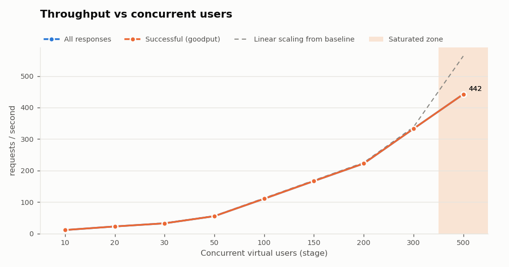

## 9. Latency Analysis

Baseline (first stage, 10 VUs): P50 23.6 ms, P95 86.2 ms. A stage counts as *latency-degraded* when P95 exceeds 2x baseline and has grown by at least 50 ms.

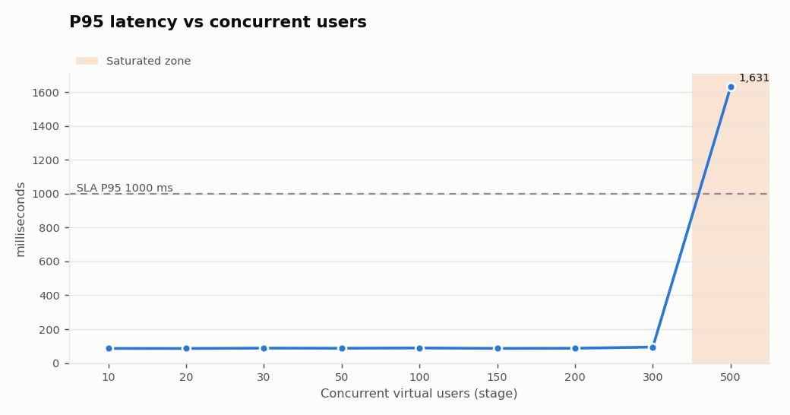

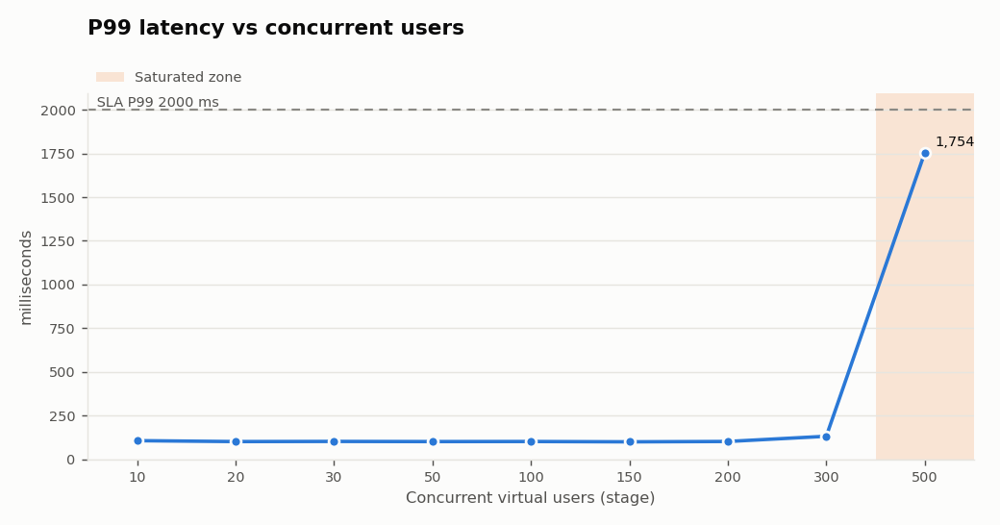

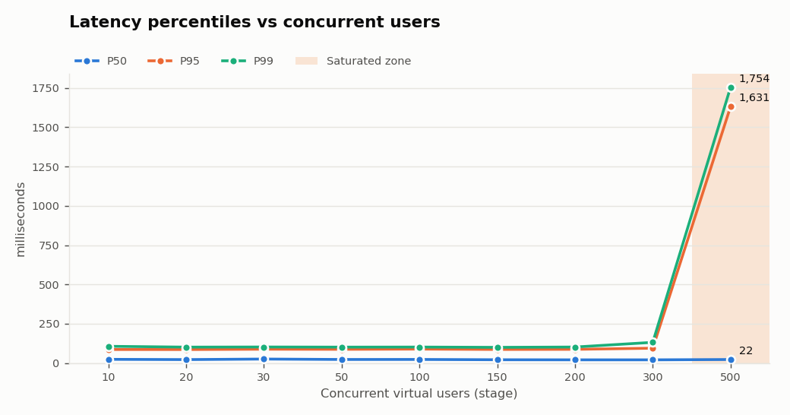

Latency per endpoint, P95 / P99 (ms):

| Endpoint (P95 / P99 ms) | 10 VUs | 20 VUs | 30 VUs | 50 VUs | 100 VUs | 150 VUs | 200 VUs | 300 VUs | 500 VUs |
|---|---|---|---|---|---|---|---|---|---|
| `cart_create` | 24.8 / 30.0 | 27.2 / 27.7 | 26.4 / 26.6 | 26.7 / 29.7 | 24.2 / 28.3 | 22.1 / 26.2 | 22.3 / 26.3 | 21.2 / 25.3 | 29.9 / 51.3 |
| `customer_search` | 43.9 / 47.5 | 43.8 / 45.9 | 43.7 / 46.8 | 42.8 / 47.0 | 41.6 / 46.1 | 39.8 / 44.2 | 39.0 / 43.7 | 38.3 / 43.0 | 46.1 / 63.9 |
| `inventory_get` | 109 / 112 | 102 / 105 | 103 / 110 | 102 / 112 | 102 / 109 | 101 / 109 | 103 / 119 | 136 / 178 | 1,762 / 1,810 |
| `order_get` | 20.3 / 23.8 | 22.0 / 24.4 | 19.9 / 21.5 | 20.7 / 23.1 | 20.3 / 23.0 | 17.7 / 20.9 | 17.2 / 20.8 | 16.6 / 22.6 | 25.2 / 43.5 |
| `order_tracking` | 16.8 / 17.4 | 17.4 / 18.8 | 19.0 / 21.8 | 19.0 / 20.9 | 18.8 / 22.0 | 17.9 / 21.4 | 16.6 / 20.5 | 17.0 / 22.0 | 25.4 / 43.5 |
| `product_get` | 21.7 / 23.5 | 20.7 / 23.2 | 21.3 / 24.3 | 20.6 / 23.6 | 19.7 / 22.6 | 18.4 / 22.5 | 17.4 / 21.3 | 16.6 / 20.9 | 25.8 / 44.6 |
| `product_list` | 34.4 / 36.4 | 36.3 / 37.9 | 34.3 / 36.8 | 32.3 / 34.7 | 32.1 / 35.4 | 31.7 / 37.1 | 29.6 / 33.9 | 28.6 / 32.7 | 36.4 / 54.2 |

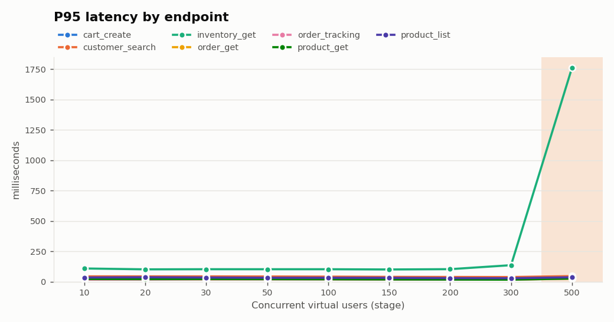

## 10. Error Analysis

HTTP status distribution (steady-state requests):

| VUs | 200 | 201 |
|---|---|---|
| 10 | 318 | 20 |
| 20 | 658 | 20 |
| 30 | 921 | 55 |
| 50 | 3,175 | 142 |
| 100 | 6,330 | 306 |
| 150 | 9,577 | 430 |
| 200 | 12,759 | 584 |
| 300 | 19,043 | 922 |
| 500 | 25,407 | 1,129 |

Status `0` means no HTTP response was received (client-side timeout or connection error).

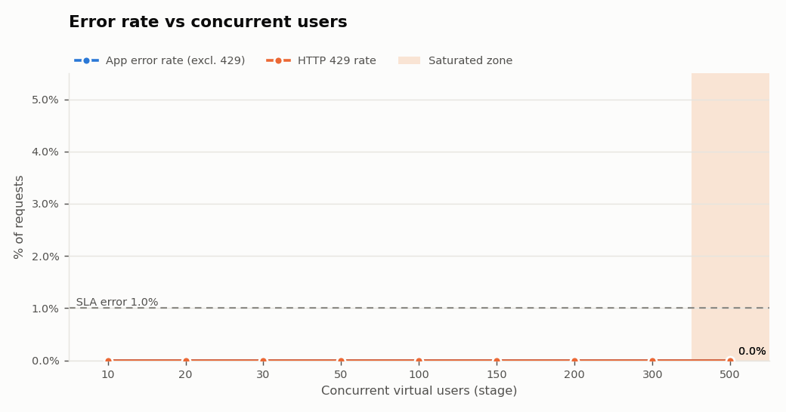

SLA violations by stage:

- **500 VUs**: P95 1631.13ms > 1000ms

## 11. Capacity Benchmark

| Question | Answer (measured) |
|---|---|
| Highest tested healthy stage | 300 VUs (controlled local mock; this does not establish production capacity) |
| Highest tested concurrency meeting the SLA | 300 VUs |
| Where latency starts degrading significantly | 500 VUs |
| Where goodput stops scaling (saturation) | 500 VUs in the load test / 750 VUs in the stress test |
| First error | 500 VUs in the stress test (1 x HTTP 504, 0.010% of requests) |
| Material errors (>= SLA error rate) | 750 VUs in the stress test (3.78% errors: 630 x HTTP 504) |
| Where rate limiting begins | not observed |
| Formal breaking threshold | not reached (>= 5% errors/timeouts) |
| Peak throughput (all responses) | 560.3 req/s @ 1000 VUs |
| Peak goodput (successful responses) | 537.7 req/s @ 1000 VUs |
| Recovered after stress? | yes |

"Highest stage" answers use the highest stage where that stage **and every stage below it** qualified, so one lucky stage after a failure cannot inflate the number. Because stages are discrete, the true limit lies between the last qualifying stage and the next one.

## 12. Operating Zones

| Zone | Stages (VUs) | Meaning |
|---|---|---|
| Healthy operating range | 10, 20, 30, 50, 100, 150, 200, 300 | Meets SLA with headroom; latency near baseline; goodput scales. |
| Degradation zone | - | Still correct, latency climbing, goodput still scaling. |
| Saturation | 500, 750, 1000 | Goodput flat or falling: extra users only add queueing (and, here, errors). |
| Rate limited | - | External quota reached: requests refused with 429. |
| Failure / breaking | - | Errors or timeouts >= 5%, or throughput falling > 10%. |

Stages above the load test's highest level come from the stress test. Rising latency alone is **not** a failure: it is the expected sign that the system is approaching a capacity limit.

## 13. Bottleneck Analysis (Load Test)

- **Goodput saturation at 500 VUs**: adding users realised only 49% of the expected goodput gain while P95 rose to 1,631 ms. This is the signature of a fixed-capacity resource (pool, thread, CPU, downstream quota) where requests start queueing.
- **Slowest-degrading endpoint: `inventory_get`**: P95 went from 109 ms at 10 VUs to 1,762 ms at 500 VUs (16.2x), while 6 other endpoints stayed below 2x.
- **Store-inventory dependency saturated from 500 VUs** (server telemetry): average utilisation 100%, wait queue up to 133, 0 acquire timeouts in the stage.
- DB connection pool did **not** saturate in this test (peak stage-average utilisation 81%).
- Application CPU was **not** the limiting factor: peak stage-average CPU 10% of one core, event-loop p99 at most 25.4 ms.

Server-side telemetry per stage (from the mock's own instrumentation; real systems would use APM/Prometheus):

| VUs | CPU avg (1 core) | RSS MB max | Event-loop p99 ms | In-flight max | DB pool util | DB queue max | DB acquire timeouts | Inventory dep util | Inv queue max | Inv timeouts |
|---|---|---|---|---|---|---|---|---|---|---|
| 10 | 1% | 96 | 23.7 | 1 | 2% | 0 | 0 | 2% | 0 | 0 |
| 20 | 1% | 96 | 24.9 | 2 | 5% | 0 | 0 | 8% | 0 | 0 |
| 30 | 1% | 96 | 24.5 | 3 | 6% | 0 | 0 | 7% | 0 | 0 |
| 50 | 3% | 96 | 25.0 | 4 | 10% | 0 | 0 | 12% | 0 | 0 |
| 100 | 4% | 96 | 25.4 | 9 | 21% | 0 | 0 | 25% | 0 | 0 |
| 150 | 5% | 96 | 24.3 | 9 | 34% | 0 | 0 | 37% | 3 | 0 |
| 200 | 6% | 98 | 24.2 | 12 | 41% | 0 | 0 | 47% | 2 | 0 |
| 300 | 8% | 99 | 23.4 | 20 | 57% | 6 | 0 | 81% | 9 | 0 |
| 500 | 10% | 125 | 21.5 | 143 | 81% | 32 | 0 | 100% | 133 | 0 |

These are **indicators** inferred from client-side metrics and mock telemetry. On a real system, confirm with server-side profiling/APM before acting on them.

## 14. Stress Test (Beyond Expected Capacity)

Stair-step without returning to zero: 100 -> 200 -> 300 -> 500 -> 750 -> 1000 VUs, `15s` ramp + `30s` hold per step, then a **recovery window**: drop to 100 VUs over `15s` and hold `60s`, then ramp down over `15s`.

| VUs | RPS | Goodput | Total req | OK | Failed | P50 | P90 | P95 | P99 | Min | Max | Error % | 4xx % | 5xx % | Timeout % | 429 % | Checks | SLA | Zone |
|---|---|---|---|---|---|---|---|---|---|---|---|---|---|---|---|---|---|---|---|
| 100 | 110.4 | 110.4 | 3,312 | 3,312 | 0 | 22.7 | 72.5 | 88.6 | 102 | 3.6 | 115 | 0.00% | 0.00% | 0.00% | 0.00% | 0.00% | 100.0% | PASS | **HEALTHY** |
| 200 | 222.4 | 222.4 | 6,672 | 6,672 | 0 | 21.1 | 73.2 | 87.2 | 101 | 3.3 | 141 | 0.00% | 0.00% | 0.00% | 0.00% | 0.00% | 100.0% | PASS | **HEALTHY** |
| 300 | 328.9 | 328.9 | 9,868 | 9,868 | 0 | 20.9 | 81.7 | 103 | 172 | 3.1 | 264 | 0.00% | 0.00% | 0.00% | 0.00% | 0.00% | 100.0% | PASS | **HEALTHY** |
| 500 | 438.6 | 438.5 | 13,157 | 13,156 | 1 | 22.0 | 1,399 | 1,636 | 1,955 | 2.9 | 2,092 | 0.01% | 0.00% | 0.01% | 0.00% | 0.00% | 100.0% | FAIL | **DEGRADED** |
| 750 | 555.8 | 534.8 | 16,675 | 16,045 | 630 | 143 | 2,139 | 2,174 | 2,217 | 4.4 | 2,267 | 3.78% | 0.00% | 3.78% | 0.00% | 0.00% | 96.2% | FAIL | **SATURATED** |
| 1000 | 560.3 | 537.7 | 16,809 | 16,131 | 678 | 570 | 2,567 | 2,605 | 2,666 | 423 | 2,758 | 4.03% | 0.00% | 4.03% | 0.00% | 0.00% | 95.8% | FAIL | **SATURATED** |

Stress stages with server-side telemetry:

| VUs | Throughput / goodput (req/s) | P95 | P99 | Error % | 5xx % | Timeout % | DB pool util | DB queue max | Inventory util | Inv queue max | CPU | Memory (RSS max) | Zone |
|---|---|---|---|---|---|---|---|---|---|---|---|---|---|
| 100 | 110.4 / 110.4 | 88.6 | 102 | 0.00% | 0.00% | 0.00% | 27% | 0 | 23% | 0 | 3% | 132 MB | **HEALTHY** |
| 200 | 222.4 / 222.4 | 87.2 | 101 | 0.00% | 0.00% | 0.00% | 47% | 1 | 53% | 1 | 7% | 132 MB | **HEALTHY** |
| 300 | 328.9 / 328.9 | 103 | 172 | 0.00% | 0.00% | 0.00% | 57% | 2 | 83% | 11 | 8% | 132 MB | **HEALTHY** |
| 500 | 438.6 / 438.5 | 1,636 | 1,955 | 0.01% | 0.01% | 0.00% | 85% | 9 | 100% | 146 | 10% | 135 MB | **DEGRADED** |
| 750 | 555.8 / 534.8 | 2,174 | 2,217 | 3.78% | 3.78% | 0.00% | 100% | 97 | 100% | 217 | 12% | 148 MB | **SATURATED** |
| 1000 | 560.3 / 537.7 | 2,605 | 2,666 | 4.03% | 4.03% | 0.00% | 100% | 351 | 100% | 222 | 13% | 185 MB | **SATURATED** |

Endpoint latency in the stress test, P95 / P99 (ms):

| Endpoint (P95 / P99 ms) | 100 VUs | 200 VUs | 300 VUs | 500 VUs | 750 VUs | 1000 VUs |
|---|---|---|---|---|---|---|
| `cart_create` | 25.0 / 28.1 | 21.1 / 24.9 | 21.6 / 25.2 | 29.7 / 38.3 | 183 / 197 | 643 / 667 |
| `customer_search` | 42.0 / 46.4 | 38.4 / 42.2 | 38.3 / 44.0 | 43.4 / 52.2 | 195 / 210 | 656 / 674 |
| `inventory_get` | 103 / 110 | 102 / 111 | 178 / 220 | 1,962 / 2,037 | 2,219 / 2,241 | 2,672 / 2,706 |
| `order_get` | 19.9 / 22.7 | 17.3 / 20.9 | 16.4 / 22.3 | 23.3 / 32.8 | 176 / 192 | 635 / 653 |
| `order_tracking` | 16.8 / 20.5 | 16.6 / 21.3 | 16.3 / 21.4 | 22.1 / 32.7 | 177 / 193 | 636 / 658 |
| `product_get` | 20.0 / 21.9 | 17.5 / 21.7 | 16.2 / 23.7 | 23.9 / 31.9 | 175 / 192 | 634 / 656 |
| `product_list` | 32.6 / 38.5 | 29.5 / 33.1 | 29.0 / 35.7 | 34.6 / 43.1 | 186 / 202 | 648 / 666 |

**Bottleneck progression (server telemetry):**

- **300 VUs:** inventory dependency high (83% utilisation, queue up to 11, 0 acquire timeouts); CPU 8%.
- **500 VUs:** inventory dependency **saturated** (100% utilisation, queue up to 146, 1 acquire timeouts (-> HTTP 504)); DB pool high (85% utilisation, queue up to 9, 0 acquire timeouts); CPU 10%.
- **750 VUs:** inventory dependency **saturated** (100% utilisation, queue up to 217, 617 acquire timeouts (-> HTTP 504)); DB pool **saturated** (100% utilisation, queue up to 97, 0 acquire timeouts); CPU 12%.
- **1000 VUs:** inventory dependency **saturated** (100% utilisation, queue up to 222, 687 acquire timeouts (-> HTTP 504)); DB pool **saturated** (100% utilisation, queue up to 351, 0 acquire timeouts); CPU 13%.

The first resource to saturate was **the store-inventory dependency** at 500 VUs; **the DB connection pool** followed at 750 VUs. Errors map to the resource that timed out: inventory acquire timeouts surface as HTTP 504, DB-pool acquire timeouts as HTTP 503.

**Failure behaviour:** errors were 1,309 x HTTP 504 (across 500, 750, 1000 VUs); **no client timeouts**; P99 stayed bounded at <= 2,666 ms; the slowest single request took 2,758 ms against a 10 s client timeout. The system **failed gracefully**: it rejected excess work quickly with explicit errors instead of hanging.

Stress findings: saturation from 750 VUs, material errors from 750 VUs, 429 onset not observed; formal breaking threshold not reached.

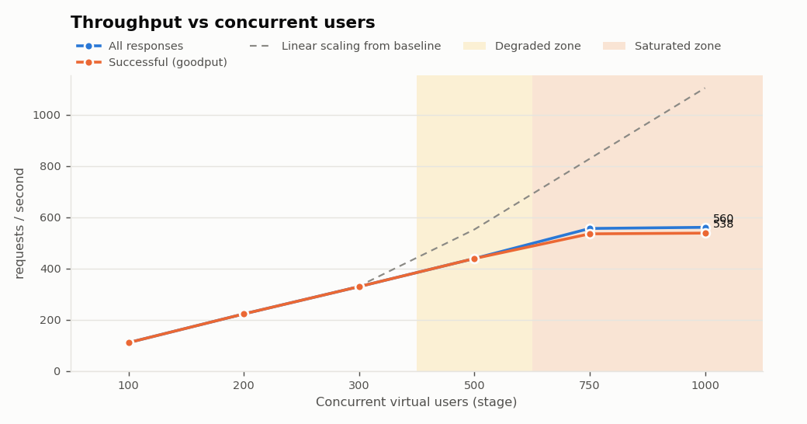

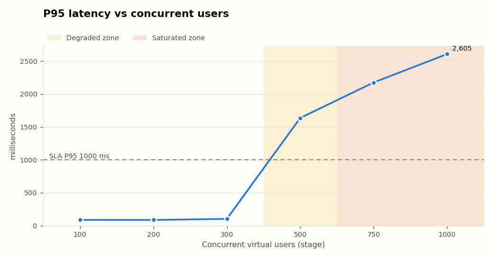

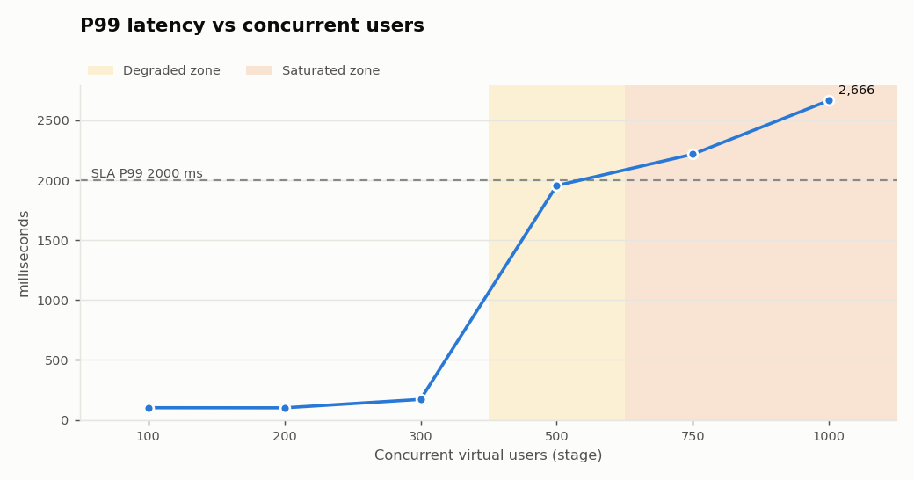

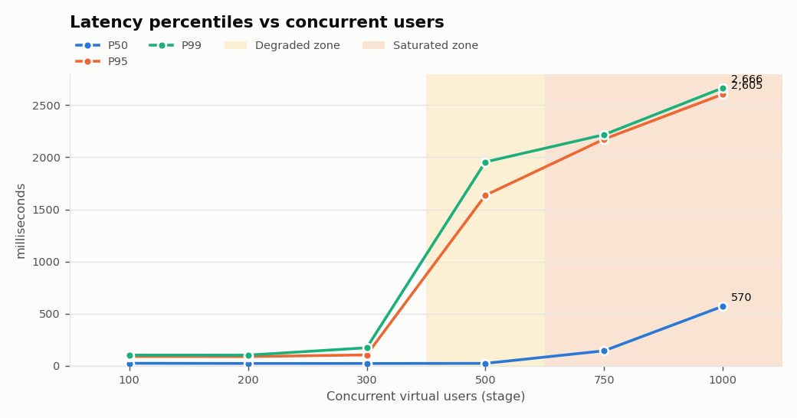

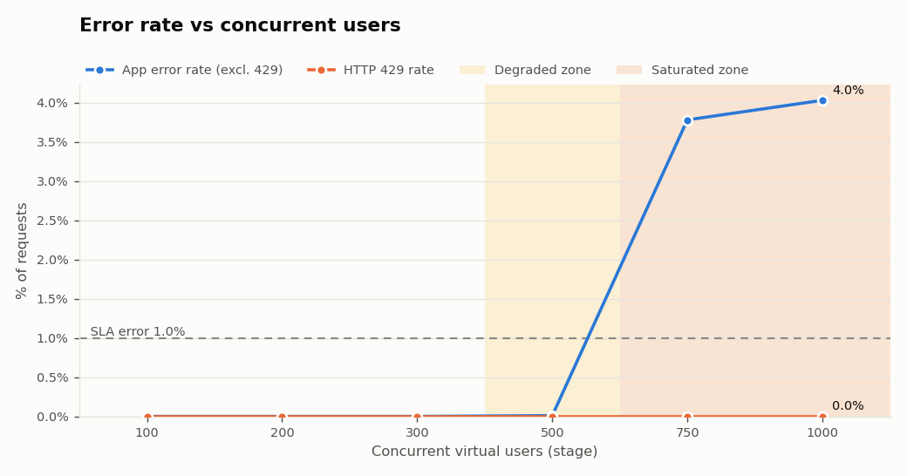

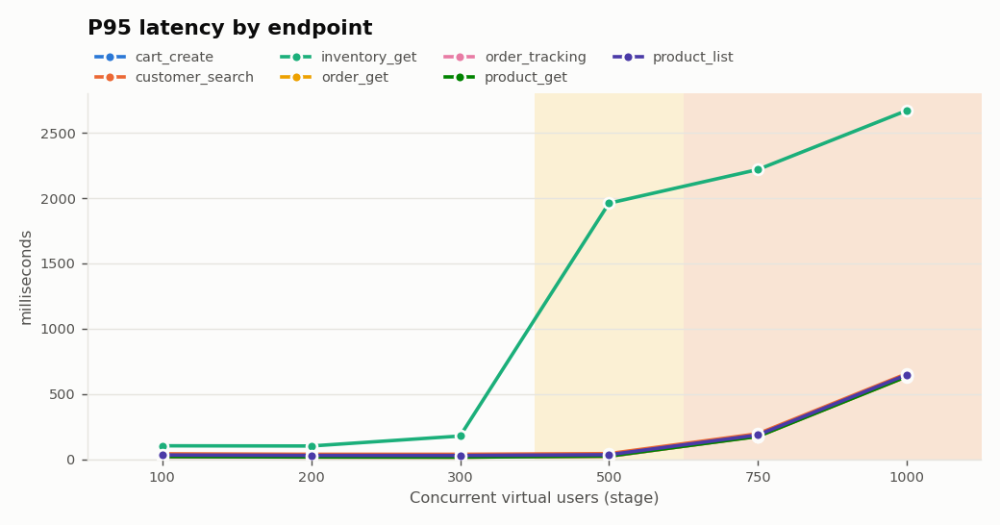

## 15. Recovery After Stress

After the 1000-VU step the load dropped to **100 VUs** and was held for 60 s (measured window). It is compared with the original 100-VU stage at the start of the stress test.

| Metric | Baseline (100 VUs, before stress) | Recovery (100 VUs, after stress) |
|---|---|---|
| Throughput / goodput (req/s) | 110.4 / 110.4 | 111.6 / 111.6 |
| P50 (ms) | 22.7 | 21.5 |
| P95 (ms) | 88.6 | 86.9 |
| P99 (ms) | 102 | 102 |
| Error rate | 0.00% | 0.00% |
| 5xx rate | 0.00% | 0.00% |
| Timeout rate | 0.00% | 0.00% |
| DB queue (avg / max) | 0.0 / 0 | 0.0 / 0 |
| Inventory queue (avg / max) | 0.0 / 0 | 0.0 / 0 |
| In-flight requests (avg / max) | 3.3 / 6 | 3.2 / 7 |

- **Did the system recover?** **Yes.** Rule: recovery P95 within 1.5x of baseline and error/timeout rates below the SLA.
- **Recovered P95 vs baseline P95:** 86.9 ms vs 88.6 ms (x0.98).
- **Did errors return to zero?** Yes (error rate 0.00%, timeouts 0.00%).
- **Did queues return to zero?** Yes: DB and inventory queue max 0 throughout the recovery window.
- **How long did recovery take?** 15 s from the moment load started dropping (this includes the 15 s ramp from 1000 to 100 VUs) until both queues were empty and the server's average latency was <= 59.7 ms (2x the baseline 29.9 ms), sustained for 5 s. Measured from 1-second server telemetry.

## 16. Capacity Knee Refinement

A separate load run (`LOAD_PROFILE=knee`) used finer stages (300, 350, 400, 450, 500 VUs) to locate the knee between the last healthy and the first degraded stage of the main run. Its baseline is its own first stage.

| VUs | RPS | Goodput | P50 | P95 | P99 | Error % | Goodput scaling | SLA | Zone |
|---|---|---|---|---|---|---|---|---|---|
| 300 | 333.7 | 333.7 | 20.0 | 99.7 | 149 | 0.000% | - | PASS | **HEALTHY** |
| 350 | 386.0 | 386.0 | 20.7 | 119 | 183 | 0.000% | 0.94 | PASS | **HEALTHY** |
| 400 | 426.2 | 426.2 | 22.3 | 371 | 520 | 0.000% | 0.73 | PASS | **DEGRADED** |
| 450 | 435.7 | 435.7 | 21.9 | 1,060 | 1,219 | 0.000% | 0.18 | FAIL | **SATURATED** |
| 500 | 428.6 | 428.6 | 21.6 | 1,776 | 1,871 | 0.000% | -0.15 | FAIL | **SATURATED** |

| VUs | CPU avg (1 core) | RSS MB max | Event-loop p99 ms | In-flight max | DB pool util | DB queue max | DB acquire timeouts | Inventory dep util | Inv queue max | Inv timeouts |
|---|---|---|---|---|---|---|---|---|---|---|
| 300 | 8% | 99 | 23.5 | 16 | 58% | 1 | 0 | 79% | 7 | 0 |
| 350 | 10% | 100 | 22.4 | 23 | 75% | 6 | 0 | 86% | 12 | 0 |
| 400 | 12% | 100 | 22.6 | 58 | 79% | 8 | 0 | 99% | 39 | 0 |
| 450 | 14% | 110 | 21.5 | 107 | 87% | 7 | 0 | 100% | 90 | 0 |
| 500 | 11% | 124 | 22.9 | 151 | 80% | 12 | 0 | 100% | 140 | 0 |

Refinement result: highest healthy stage 350 VUs; highest stage meeting the SLA 400 VUs; latency degradation from 400 VUs; saturation from 450 VUs.

## 17. Recommendations

- On this mock, **350 VUs is the highest tested healthy stage** (from the knee refinement run). Treat it as an upper bound, not an operating target: plan expected peak demand comfortably below it.
- Protect the inventory dependency (the first resource to saturate): cache availability for a few seconds, add a circuit breaker with an 'availability unknown' fallback, and agree a capacity figure with the store-systems team. Re-test with a higher `MOCK_INVENTORY_CONCURRENCY` to confirm cause and effect.
- The DB pool saturates next: cache hot reads (customer search, product detail) and review pool sizing against database CPU and connection limits before simply raising it.
- Replace the example SLAs with the customer's real targets (per endpoint where possible) and re-run the same profile.
- Repeat each run at least 3 times and compare. Single runs on a laptop have noticeable run-to-run variance.
- Run the load generator on separate infrastructure from the system under test (here both share one machine).
- Next tests: soak at the highest healthy stage (hours) and a spike test (sudden surge) on authorised staging.

## 18. Limitations

- The target is a local mock with synthetic data and simulated resource limits. It demonstrates the method; it says nothing about the real product's capacity.
- k6 and the target share one machine, so they compete for CPU and network stack. Load-generator CPU was not measured.
- Closed workload model (ramping VUs with think time): throughput depends on response time. An open model (arrival-rate executor) is better for testing a fixed request rate and avoids coordinated omission.
- Holds of 30-60 s find the knee but not leaks, GC pressure, cache expiry or connection churn; a soak test is needed.
- Low stages have few samples (e.g. 338 requests at 10 VUs), so their P99 rests on a handful of requests.
- Single run: no statistical repetition.
- Mostly read traffic (writes limited to an in-memory cart). Checkout/payment paths were deliberately not tested.
- Network latency and bandwidth were not measured.
- Smoke test before the runs: 392 requests, checks pass rate 100.0%, error rate 0.00%.

## 19. What Real Staging Testing Should Add

| Area | What to collect / do |
|---|---|
| APM & distributed tracing | Per-endpoint and per-span latency (OpenTelemetry, Datadog, New Relic); trace slow requests to the responsible service or query |
| CPU & memory | Per service, pod and node (Prometheus node-exporter / cAdvisor, CloudWatch); GC pauses, OOM kills, restarts |
| Database | DB CPU, IOPS, slow queries, lock waits, replication lag (Performance Insights, pg_stat_statements) |
| Connection pools | Active / idle / waiting connections and acquire time for DB and HTTP client pools; max connections on the DB side |
| Load balancer | Request count, target response time, surge queue, 5xx from LB vs targets, connection errors |
| Network | Throughput, retransmits, cross-AZ latency; place load generators in the same region as real users |
| Downstream dependencies | Latency, error rate and quotas of payments, inventory, search, tax, CRM; circuit-breaker state |
| Autoscaling | Scaling events and lag (HPA / ASG); whether capacity was added in time |
| Production-like data | Seeded synthetic customers, products, stores and orders at production volume and distribution |
| Realistic traffic | Action weights, think times and peak concurrency derived from production analytics, per channel (web, app, store, call center) |
| Monitoring dashboards | One Grafana/Datadog dashboard with k6 metrics (`--out experimental-prometheus-rw`) and server metrics on a shared timeline; filter by `X-Load-Test` header |

## 20. Applying This Methodology to a Real Enterprise Staging Environment

1. **Authorisation & scope**: written approval from the system owner; agree the environment, time window, maximum
   load, stop conditions and an on-call contact. Never point this at production. The framework refuses remote targets
   unless `CONFIRM_AUTHORIZED_TARGET=true` is set.
2. **Production-like staging**: same instance types, autoscaling rules, DB size and data volume as production (or a
   documented ratio). Replace `k6/data/test-data.json` with IDs of seeded synthetic test records.
3. **Workload model from real data**: derive weights, think time and peak concurrency from production analytics.
4. **Real SLAs**: per-endpoint latency and error budgets from the business; set them in `.env`.
5. **Point the framework at staging**: `TARGET_BASE_URL`, `AUTH_TYPE`, `API_TOKEN` (from a secrets manager in CI).
6. **Observe server-side** during every stage (section above), correlated by the stage time windows in the results JSON.
7. **Run order**: smoke -> incremental load -> knee refinement -> stress with recovery -> soak -> spike.
8. **Repeat and compare** after each fix; gate releases in CI with `SLA_GATE_VUS`.
