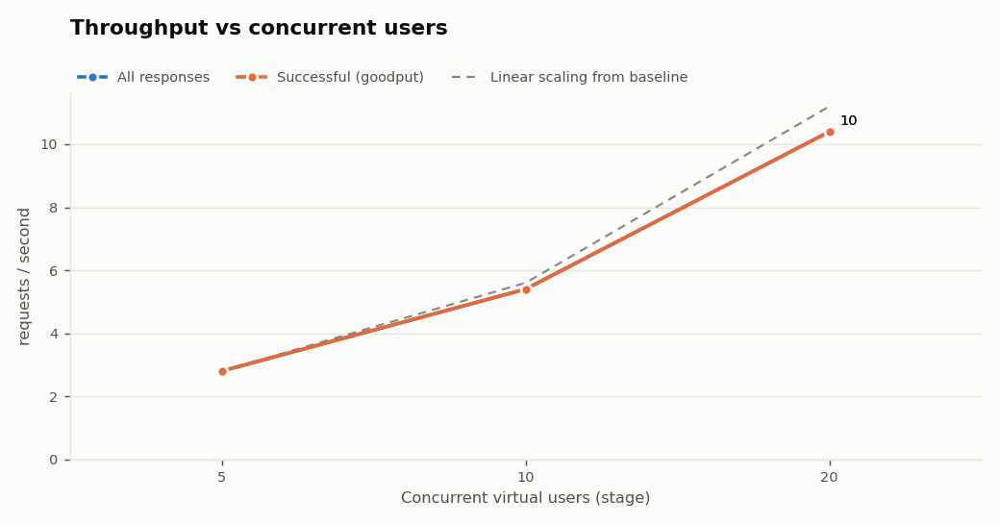
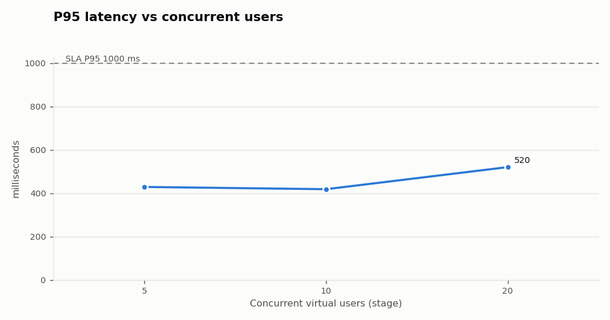
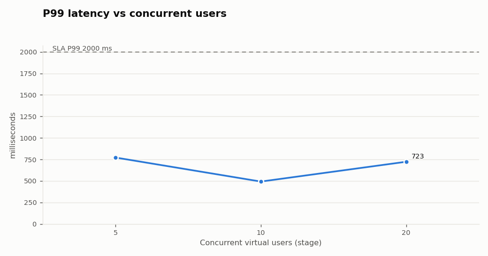
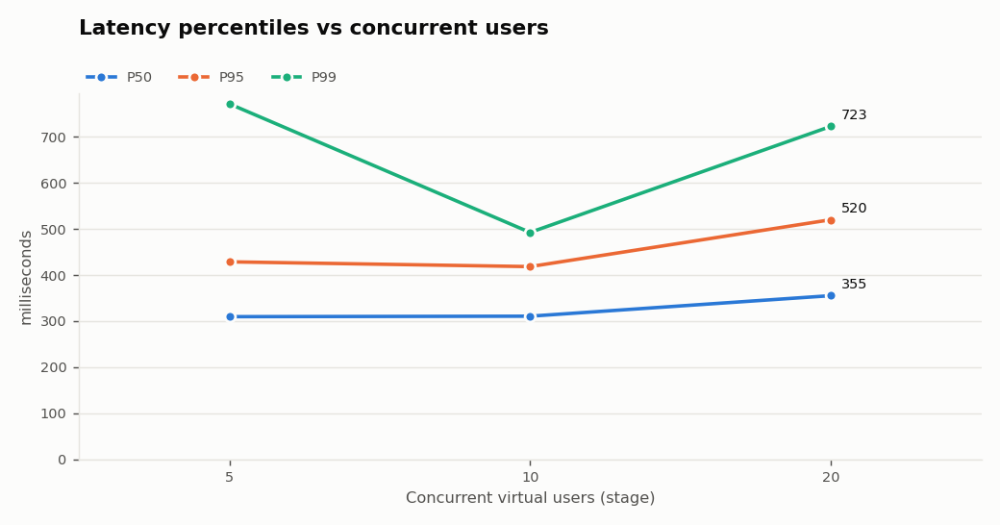
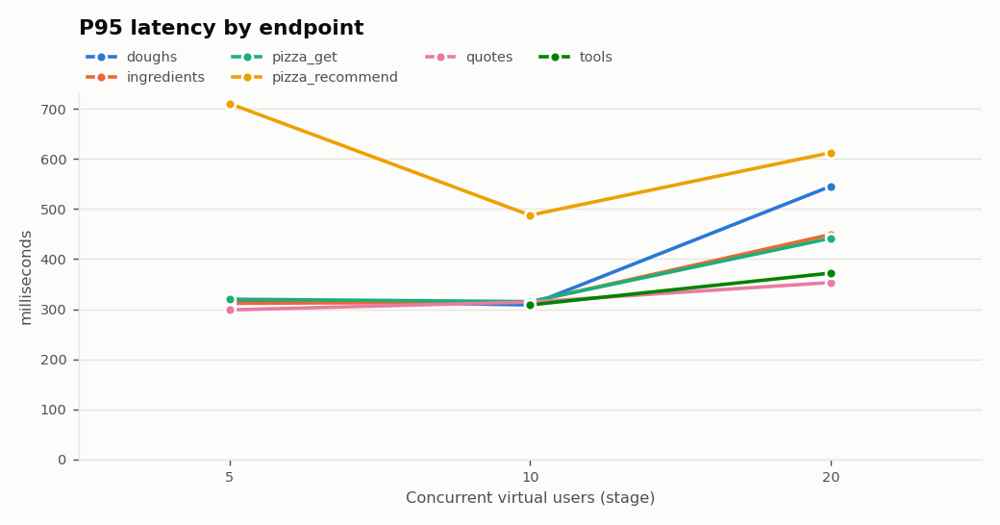
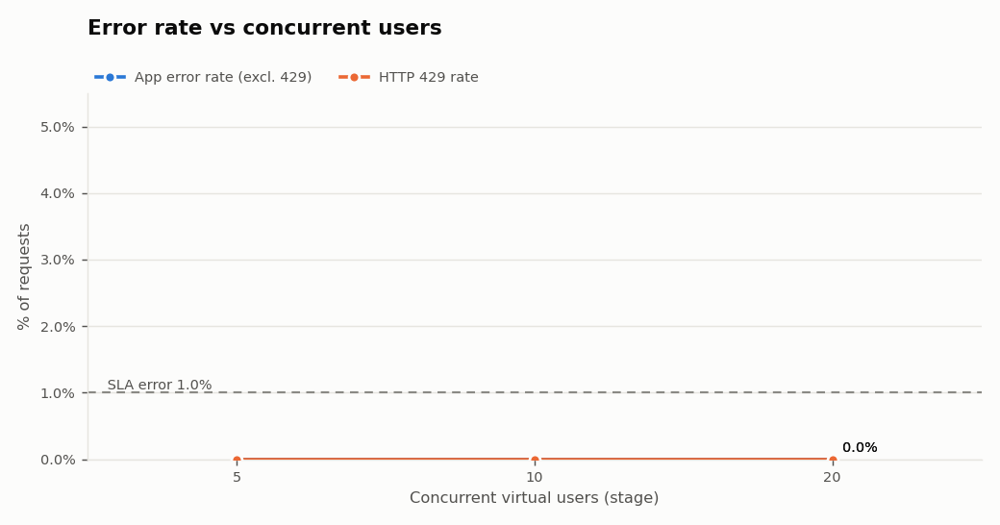

# Performance & Capacity Report

_Generated 2026-10-02 08:06 UTC by `scripts/generate-report.py` from `load-test-2026-10-02T07-58-16.json`. All figures are measured values from those files._

> **Context:** this run targets **QuickPizza** (`quickpizza.grafana.com`), a public demo API operated by Grafana Labs that explicitly permits load testing. It is a shared environment, so load was kept modest. Latency includes the internet path from this machine to the service. No server-side telemetry is available. **The numbers describe QuickPizza's public demo as seen from this client, not any product.**

## 1. Executive Summary

- **Highest tested healthy stage:** 20 VUs.
- **Highest stage meeting the example SLA:** 20 VUs.
- **Latency degradation:** not observed in the load test.
- **Saturation (goodput stops scaling):** not observed.
- **Errors:** none observed in any stage.
- **Rate limiting (HTTP 429):** not observed.
- **Breaking point:** the formal 5% error threshold was **not** reached (highest error rate 0.00% at 5 VUs).
- **Peak throughput vs goodput:** all responses 10.4 req/s at 20 VUs; successful responses (goodput) 10.4 req/s at 20 VUs.

## 2. What This Test Proves

- **The methodology works end to end:** smoke test -> incremental load (0 -> N -> hold -> 0 per stage) -> stress beyond the expected range -> recovery, with every stage measured on steady-state samples only.
- **Incremental load testing exposes the capacity curve:** 3 stages from 5 to 20 VUs show where the system is healthy, where latency degrades and where goodput stops scaling, instead of a single pass/fail at 500 users.
- **Safety controls work:** remote targets are refused without explicit authorisation; per-stage abort valves stop the test on excessive errors or rate limiting.

## 3. What This Test Does NOT Prove

- It does **NOT** prove the capacity of the customer's system; it describes only the tested target as seen from this client.
- Actual capacity must be established by running the same workload against an **authorised**, production-like staging environment.
- Real infrastructure metrics (APM, CPU, memory, database, connection pools, load balancer, network, downstream dependencies) are required to confirm bottlenecks. The mock's own telemetry is a stand-in, not a substitute.
- Single run, short holds (30-60 s): no statistical repetition and no long-duration (soak) behaviour such as memory leaks or cache expiry.

## 4. Test Environment

| Item | Value |
|---|---|
| Target | `https://quickpizza.grafana.com` (profile `quickpizza`) |
| Authentication | token (credential configured via env) |
| Load generator | k6 (Grafana k6), JavaScript scenarios |
| Load generator location | this machine, over the internet |
| Load test window | 2026-10-02 07:57:08 UTC to 2026-10-02 07:58:16 UTC (69 s) |
| Stress test window | not run |
| Server-side telemetry | not available |

## 5. Test Configuration

| Setting | Value |
|---|---|
| Executor | ramping-vus (closed model) |
| Action weights | recommend 40%, menu 20%, pizza_get 15%, doughs 10%, tools 10%, quotes 5% |
| Writes enabled | True |
| Think time | 1-2 s between actions |
| Request timeout | 10s |
| SLA: P95 / P99 | < 1000 ms / < 2000 ms |
| SLA: error / 5xx / timeout rate | < 1.0% / < 0.5% / < 0.5% |
| SLA: HTTP 429 rate | < 1.0% (reported separately from errors) |

> The SLA values are **examples** chosen for this demo. For a production decision they must be replaced with the business's real requirements (ideally per endpoint).

## 6. Load Profile

Each stage ramps **0 -> N** over `5s`, **holds** for the listed duration, ramps back to 0 over `5s` and cools down for `3s` before the next stage. Only samples from the hold window are used for the stage's numbers.

Stages: 5 VUs (10s) -> 10 VUs (10s) -> 20 VUs (10s)

## 7. Metrics Collected

Per stage (steady-state only): concurrent VUs, throughput (all responses) and goodput (successful responses) per second, total / successful / failed requests, HTTP status distribution, error rate (excluding 429), 4xx rate (excluding 429), 5xx rate, timeout rate, HTTP 429 rate, response-check pass rate, P50/P90/P95/P99/min/max latency and per-endpoint latency. `Failed` counts every non-2xx/3xx response; `Error %` excludes 429 so that rate limiting is not mistaken for an application fault.

**Infrastructure metrics (CPU, memory, DB CPU, DB connections, network, dependency latency) were not available for this run.** See section 18 for how they are collected in a real environment.

## 8. Load Test Results

| VUs | RPS | Goodput | Total req | OK | Failed | P50 | P90 | P95 | P99 | Min | Max | Error % | 4xx % | 5xx % | Timeout % | 429 % | Checks | SLA | Zone |
|---|---|---|---|---|---|---|---|---|---|---|---|---|---|---|---|---|---|---|---|
| 5 | 2.8 | 2.8 | 28 | 28 | 0 | 310 | 419 | 429 | 772 | 293 | 899 | 0.00% | 0.00% | 0.00% | 0.00% | 0.00% | 100.0% | PASS | **HEALTHY** |
| 10 | 5.4 | 5.4 | 54 | 54 | 0 | 311 | 406 | 418 | 493 | 286 | 494 | 0.00% | 0.00% | 0.00% | 0.00% | 0.00% | 100.0% | PASS | **HEALTHY** |
| 20 | 10.4 | 10.4 | 104 | 104 | 0 | 355 | 476 | 520 | 723 | 288 | 932 | 0.00% | 0.00% | 0.00% | 0.00% | 0.00% | 100.0% | PASS | **HEALTHY** |

Latency in ms. Goodput = successful responses/s. Zones: **HEALTHY**: SLA met, latency near baseline, goodput scaling. **DEGRADED**: latency well above baseline or SLA missed, but goodput still scaling. **SATURATED**: goodput realised less than 50% of the gain the extra users should produce, or fell: more users only add queueing. **RATE_LIMITED**: HTTP 429 above the 429 SLA (external quota). **BREAKING**: error/timeout rate >= 5% or throughput falling > 10%. `*` = partial stage (test stopped early).

Compact view:

| VUs | RPS | P50 | P95 | P99 | Error % | 429 % |
|---|---|---|---|---|---|---|
| 5 | 2.8 | 310 | 429 | 772 | 0.000% | 0.00% |
| 10 | 5.4 | 311 | 418 | 493 | 0.000% | 0.00% |
| 20 | 10.4 | 355 | 520 | 723 | 0.000% | 0.00% |

## 9. Latency Analysis

Baseline (first stage, 5 VUs): P50 310 ms, P95 429 ms. A stage counts as *latency-degraded* when P95 exceeds 2x baseline and has grown by at least 50 ms.

Latency per endpoint, P95 / P99 (ms):

| Endpoint (P95 / P99 ms) | 5 VUs | 10 VUs | 20 VUs |
|---|---|---|---|
| `doughs` | 318 / 320 | 308 / 309 | 546 / 676 |
| `ingredients` | 312 / 312 | 314 / 318 | 449 / 472 |
| `pizza_get` | 320 / 322 | 315 / 317 | 442 / 477 |
| `pizza_recommend` | 711 / 861 | 488 / 494 | 613 / 840 |
| `quotes` | 299 / 299 | 314 / 315 | 353 / 360 |
| `tools` | - / - | 309 / 309 | 372 / 380 |

## 10. Error Analysis

HTTP status distribution (steady-state requests):

| VUs | 200 |
|---|---|
| 5 | 28 |
| 10 | 54 |
| 20 | 104 |

Status `0` means no HTTP response was received (client-side timeout or connection error).

## 11. Capacity Benchmark

| Question | Answer (measured) |
|---|---|
| Highest tested healthy stage | 20 VUs |
| Highest tested concurrency meeting the SLA | 20 VUs |
| Where latency starts degrading significantly | not observed |
| Where goodput stops scaling (saturation) | not observed |
| First error | none observed |
| Material errors (>= SLA error rate) | not observed |
| Where rate limiting begins | not observed |
| Formal breaking threshold | not reached (>= 5% errors/timeouts) |
| Peak throughput (all responses) | 10.4 req/s @ 20 VUs |
| Peak goodput (successful responses) | 10.4 req/s @ 20 VUs |
| Recovered after stress? | not measured |

"Highest stage" answers use the highest stage where that stage **and every stage below it** qualified, so one lucky stage after a failure cannot inflate the number. Because stages are discrete, the true limit lies between the last qualifying stage and the next one.

## 12. Operating Zones

| Zone | Stages (VUs) | Meaning |
|---|---|---|
| Healthy operating range | 5, 10, 20 | Meets SLA with headroom; latency near baseline; goodput scales. |
| Degradation zone | - | Still correct, latency climbing, goodput still scaling. |
| Saturation | - | Goodput flat or falling: extra users only add queueing (and, here, errors). |
| Rate limited | - | External quota reached: requests refused with 429. |
| Failure / breaking | - | Errors or timeouts >= 5%, or throughput falling > 10%. |

Stages above the load test's highest level come from the stress test. Rising latency alone is **not** a failure: it is the expected sign that the system is approaching a capacity limit.

## 13. Bottleneck Analysis (Load Test)

- No bottleneck signature was observed in the tested range. The system was not pushed to its limit; extend the profile (higher VUs or a stress test).

These are **indicators** inferred from client-side metrics. On a real system, confirm with server-side profiling/APM before acting on them.

## 14. Recommendations

- On this target, **20 VUs is the highest tested healthy stage**. Treat it as an upper bound, not an operating target: plan expected peak demand comfortably below it.
- Locate the knee precisely with `npm run load:knee` (stages 300, 350, 400, 450, 500) before quoting any limit.
- Replace the example SLAs with the customer's real targets (per endpoint where possible) and re-run the same profile.
- Repeat each run at least 3 times and compare. Single runs on a laptop have noticeable run-to-run variance.
- Run the load generator on separate infrastructure from the system under test (here both share one machine).
- Next tests: soak at the highest healthy stage (hours) and a spike test (sudden surge) on authorised staging.

## 15. Limitations

- Closed workload model (ramping VUs with think time): throughput depends on response time. An open model (arrival-rate executor) is better for testing a fixed request rate and avoids coordinated omission.
- Holds of 30-60 s find the knee but not leaks, GC pressure, cache expiry or connection churn; a soak test is needed.
- Low stages have few samples (e.g. 28 requests at 5 VUs), so their P99 rests on a handful of requests.
- Single run: no statistical repetition.
- Mostly read traffic (writes limited to an in-memory cart). Checkout/payment paths were deliberately not tested.
- Network latency and bandwidth were not measured.
- No server-side infrastructure metrics were collected, so bottlenecks are inferred from client-side signals only.
- Smoke test before the runs: 114 requests, checks pass rate 100.0%, error rate 0.00%.

## 16. What Real Staging Testing Should Add

| Area | What to collect / do |
|---|---|
| APM & distributed tracing | Per-endpoint and per-span latency (OpenTelemetry, Datadog, New Relic); trace slow requests to the responsible service or query |
| CPU & memory | Per service, pod and node (Prometheus node-exporter / cAdvisor, CloudWatch); GC pauses, OOM kills, restarts |
| Database | DB CPU, IOPS, slow queries, lock waits, replication lag (Performance Insights, pg_stat_statements) |
| Connection pools | Active / idle / waiting connections and acquire time for DB and HTTP client pools; max connections on the DB side |
| Load balancer | Request count, target response time, surge queue, 5xx from LB vs targets, connection errors |
| Network | Throughput, retransmits, cross-AZ latency; place load generators in the same region as real users |
| Downstream dependencies | Latency, error rate and quotas of payments, inventory, search, tax, CRM; circuit-breaker state |
| Autoscaling | Scaling events and lag (HPA / ASG); whether capacity was added in time |
| Production-like data | Seeded synthetic customers, products, stores and orders at production volume and distribution |
| Realistic traffic | Action weights, think times and peak concurrency derived from production analytics, per channel (web, app, store, call center) |
| Monitoring dashboards | One Grafana/Datadog dashboard with k6 metrics (`--out experimental-prometheus-rw`) and server metrics on a shared timeline; filter by `X-Load-Test` header |

## 17. Applying This Methodology to a Real Enterprise Staging Environment

1. **Authorisation & scope**: written approval from the system owner; agree the environment, time window, maximum
   load, stop conditions and an on-call contact. Never point this at production. The framework refuses remote targets
   unless `CONFIRM_AUTHORIZED_TARGET=true` is set.
2. **Production-like staging**: same instance types, autoscaling rules, DB size and data volume as production (or a
   documented ratio). Replace `k6/data/test-data.json` with IDs of seeded synthetic test records.
3. **Workload model from real data**: derive weights, think time and peak concurrency from production analytics.
4. **Real SLAs**: per-endpoint latency and error budgets from the business; set them in `.env`.
5. **Point the framework at staging**: `TARGET_BASE_URL`, `AUTH_TYPE`, `API_TOKEN` (from a secrets manager in CI).
6. **Observe server-side** during every stage (section above), correlated by the stage time windows in the results JSON.
7. **Run order**: smoke -> incremental load -> knee refinement -> stress with recovery -> soak -> spike.
8. **Repeat and compare** after each fix; gate releases in CI with `SLA_GATE_VUS`.
